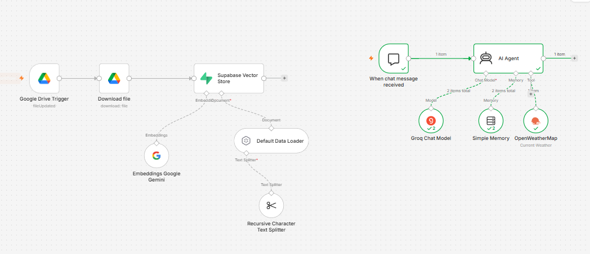
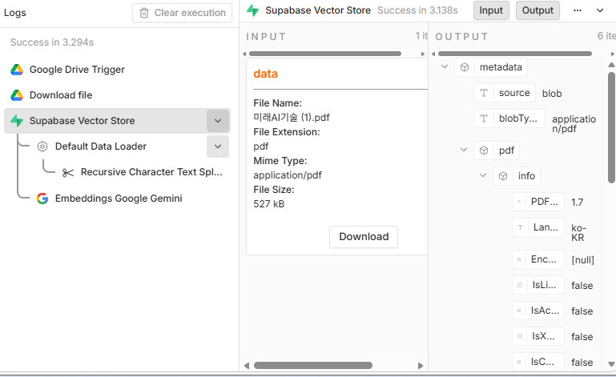
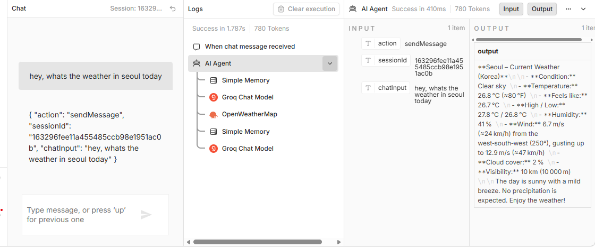

# n8n 기반 RAG 데이터 파이프라인 및 도구 활용 AI 에이전트 구축

본 프로젝트는 **n8n** 워크플로우 자동화 플랫폼을 활용하여 **자동화된 문서 임베딩 파이프라인**과 **외부 API 도구를 연동한 AI 에이전트 시스템**을 구현한 5주차 실습 프로젝트입니다.

---

## 1. 프로젝트 개요

이 시스템은 크게 두 가지 독립적인 워크플로우 파이프라인으로 구성되어 있습니다:

1. **Google Drive 기반 RAG 자동 임베딩 파이프라인**: 구글 드라이브 내 문서 업데이트를 감지하여 텍스트 분할, 벡터 임베딩 생성 및 벡터 데이터베이스 저장 과정을 자동화합니다.
2. **실시간 도구 연동 AI 에이전트**: 사용자의 질의에 맞춰 메모리를 유지하고 외부 날씨 API(OpenWeatherMap)를 호출하여 답변하는 초고속 AI 에이전트를 구축합니다.

---

## 2. 워크플로우 아키텍처

### 2.1 문서 임베딩 파이프라인 

* **Google Drive Trigger (`fileUpdated`)**: 구글 드라이브 지정 폴더 내 파일 변경 감지
* **Download File**: 감지된 파일 자동 다운로드
* **Default Data Loader & Recursive Character Text Splitter**: 문서 텍스트 로드 및 청크(Chunk) 단위 분할
* **Embeddings Google Gemini**: Gemini Embedding API를 통한 텍스트 벡터화
* **Supabase Vector Store**: 생성된 벡터 데이터를 Supabase DB에 자동 저장 및 인덱싱

### 2.2 실시간 도구 활용 AI 에이전트 

* **When chat message received**: 사용자 채팅 메시지 수신 트리거
* **AI Agent**: 추론, 메모리 관리, 도구 호출을 총괄하는 중앙 오케스트레이터
* **Groq Chat Model**: 초고속 LLM 추론 엔진 연결
* **Simple Memory**: 이전 대화 맥락을 기억하는 메모리 모듈
* **OpenWeatherMap Tool**: 실시간 날씨 데이터 조회가 필요한 경우 외부 API 자동 호출

---

## 3. 기술 스택 

| 구분 | 사용 기술 및 서비스 |
| :--- | :--- |
| **Automation Platform** | n8n |
| **LLM Inference** | Groq Chat Model |
| **Embedding Model** | Google Gemini Embeddings |
| **Vector Database** | Supabase Vector Store |
| **Cloud Storage** | Google Drive |
| **External API / Tool** | OpenWeatherMap API |

---

## 4. 설치 및 실행 방법

1. 본 저장소의 `workflow.json` (또는 내보낸 JSON 파일)을 다운로드합니다.
2. n8n 워크플로우 에디터 상단 메뉴에서 **Import from File**을 선택하여 JSON 파일을 불러옵니다.
3. 다음 연동 서비스의 자격 증명(Credentials)을 n8n에 등록합니다:
   * Google Drive API
   * Google Gemini API Key
   * Supabase Connection Details
   * Groq API Key
   * OpenWeatherMap API Key
4. 각 노드의 Credential 설정을 완료한 후 워크플로우를 활성화(Activate)합니다.
